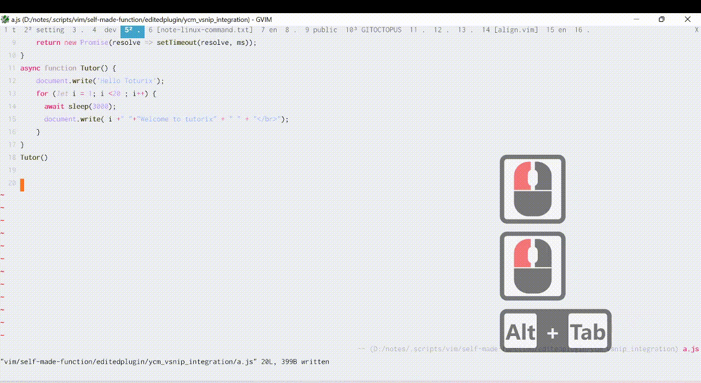

# Feature
These extension allow you to obtain vsnip completion item in YCM popup.

#### Why we need this?
why don't use [ultisnips](https://github.com/SirVer/ultisnips) (which already have integration with YCM)?

Because ultisnips is slower compared to vsnips (at the time this plugin was written)

#### Demo


# Installation
1. copy `vsnip_completer.py` to `<your_plugin_folder>/YouCompleteMe/third_party/ycmd/ycmd/completers/general/`
2. copy and replace `general_completer_store.py` to `<your_plugin_folder>/YouCompleteMe/third_party/ycmd/ycmd/completers/general/general_completer_store.py`
3. Add this config to your vimrc

```
" pass vsnip completion item to YCM server

let g:ycm_extra_conf_vim_data = ['vsnip#get_complete_items(bufnr())'] 
```


